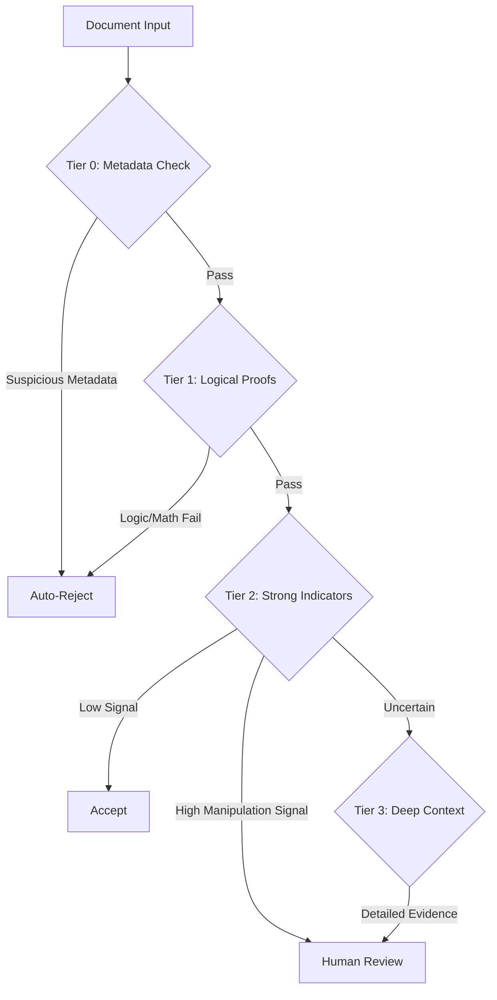

# Strategy 6: Hybrid Multi-Tier Detection System

## Approach

This strategy integrates multiple detection methods into a hierarchical "tiered" workflow designed to balance accuracy, cost, and speed. Recognizing that different forgery types require different tools, we structure the analysis into three distinct layers, with documents passing from one tier to the next only if necessary.

The workflow consists of:

**Tier 0: Metadata Filtering (The "Low-Hanging Fruit")**
Before any expensive analysis, we check the file's basic metadata. Simple checks verify if the software tag indicates editing tools (Photoshop, GIMP), if the creation date is inconsistent with modification dates, or if the file structure (e.g., missing EXIF in a "camera-original" photo) raises red flags. This filters out the clumsiest forgeries instantly at near-zero cost.

**Tier 1: Definitive Proofs (The "Hard" Filter)**
This first layer performs fast, low-cost checks for definitive signs of fraud that do not require complex interpretation. We use Gemini to validate "hard" data points such as MRZ checksums, date logic (e.g., verifying the holder's age against their birth date), and the presence of mandatory document fields. If a document fails these logical checks, it is immediately rejected as a definitive fake.

**Tier 2: Strong Indicators (The "Soft" Filter)**
Documents that pass the initial logic checks proceed to this deeper analysis layer. Here, we investigate visual consistency using more advanced tools like embedding consistency analysis (Strategy 5) and splice detection algorithms. We look for "soft" signs of manipulation—such as a photo that doesn't visually match the background texture or regions with inconsistent compression artifacts—that suggest a composite forgery.

**Tier 3: Contextual Signals (The "Deep" Dive)**
For ambiguous cases that remain unclear after Tier 2, we deploy specialized, computationally intensive tools to gather maximum context. This includes frequency-domain analysis to detect AI-generated content (Strategy 4) and cross-modal checks (comparing photo content to text descriptions). These signals are often subtle and serve primarily to provide detailed technical evidence for a human reviewer.

By prioritizing definitive proofs over probabilistic signals, this tiered approach uses resources efficiently and provides clear, explainable reasons for rejection at each stage.

## Process Flow

